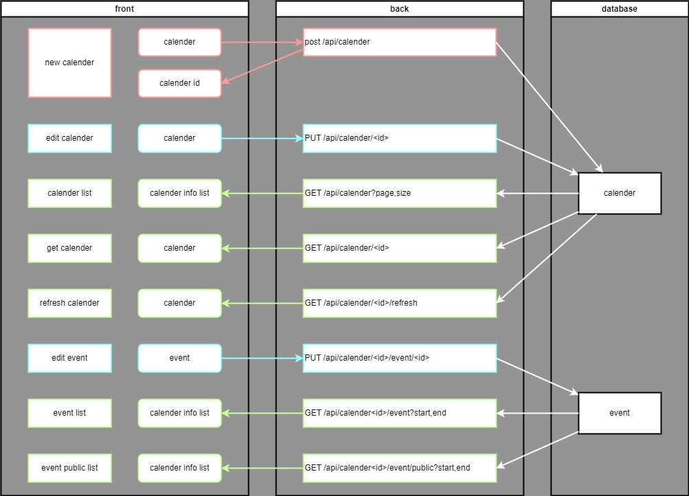

# endpoint

structure


***

## カレンダー登録

```http request
POST /api/calender
Content-Type: application/json
```

**body**

> [CalenderInfo](object.md#calenderinfo)

**response**

> CalenderId: int

***

## カレンダー編集

```http request
PUT /api/calender/:calender-id
Content-Type: application/json
```

**body**

> [CalenderInfo](object.md#calenderinfo)

***

## カレンダーリスト

```http request
GET /api/calender?page,size
Content-Type: application/json
```

**query**

| name | type | default | description |
|------|------|---------|-------------|
| page | int  | 0       | 表示位置        |   
| size | int  | 10      | 1ページの表示数    |

**response**

> [
> [CalenderInfo](object.md#calenderinfo)
> ]

***

## カレンダー取得

```http request
GET /api/calender/:calender-id
Content-Type: application/json
```

**response**

> [CalenderInfo](object.md#calenderinfo)

***

## カレンダー更新

```http request
GET /api/calender/:calender-id/refresh
Content-Type: application/json
```

***

## イベント編集

```http request
PUT /api/calender/:calender-id/event/<id>
Content-Type: application/json
```

**body**

[Event](object.md#event)

## イベントリスト

```http request
GET /api/calender/<calender-id>/event?start,end
Content-Type: application/json
```

**response**
[
[Event](object.md#event)
]

## 公開イベントリスト

```http request
GET /api/calender/<calender-id>/public-event?start,end
Content-Type: application/json
```

**response**
[
[Event](object.md#event)
]

